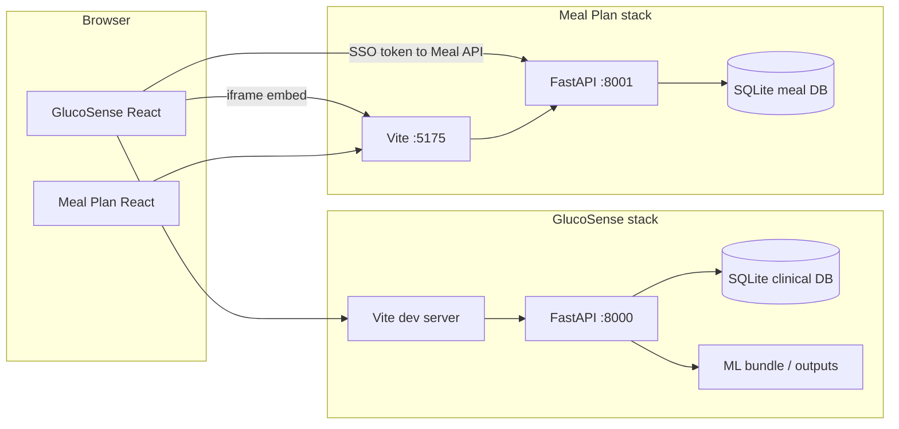

# GlucoSense integrated system — architecture and functionality

This document describes how the **GlucoSense** clinical decision-support portal and the **Meal Plan (Glocusense)** application fit together: major components, runtime topology, data flows, and end-to-end behaviour. It reflects the repository layout under this workspace.

---

## 1. Purpose and scope

The system supports **Type 1 diabetes–oriented clinical workflows** in a demo/education setting:

- **Insulin dosing guidance** driven by a trained ML model (classification with confidence, explanations where SHAP is available, structured recommendation text).
- **Patient registration**, **assessment capture**, **alerts**, **glucose trends**, **dose logging**, **reports**, and **clinician feedback** for continuous improvement.
- **Meal planning** as a separate product (search, chatbot, recommendations, glucose logging) that is **embedded** in the clinician dashboard and reachable as a full-screen experience for patients.

All outputs are **decision support only**; the API and UI state that a qualified clinician must validate any recommendation.

---

## 2. High-level system topology

Three runnable stacks are normally active in development (see root `README.md`):

| Process | Typical port | Responsibility |
|--------|----------------|----------------|
| **GlucoSense API** | 8000 | Clinical CDS REST API, SQLite persistence, model inference |
| **GlucoSense UI** | 5173 (or next) | React (Vite) SPA; proxies `/api` to 8000 |
| **Meal Plan API** | 8001 | Auth (JWT), foods, RAG/chat, meal recommendations, glucose |
| **Meal Plan UI** | 5175 | React SPA; proxies `/api` to 8001 |

GlucoSense **must** talk to the meal API on **8001** so routes are not mixed with the clinical API on **8000**.

**Docker** (`docker-compose.yml`) maps the same idea to **8080** (GlucoSense), **8081** (meal API), **8082** (meal web + nginx). Build-time `VITE_*` variables point the portal at those URLs.

---

## 3. GlucoSense — architecture

### 3.1 Frontend (`Clinical-Insulin-Recommendation/frontend/`)

- **Stack:** React 18, React Router 6, Vite 5, Recharts, jsPDF (reports).
- **Entry:** `main.jsx` wraps the app with `ClinicalProvider` (global session, theme, patients, notifications, alerts preview, recent metrics).
- **Routing** (`App.jsx`):
  - `/` — landing or redirect by role (`HomeEntry`).
  - `/login` — sign-in.
  - `/meal-plan` — **patient** full-screen meal shell (`MealPlanShell`); requires sign-in.
  - `/workspace` (constant `WORKSPACE_PATH`) — **clinician** area behind `RequireSignedIn` + `RequireClinician` + `ApiGate` (waits for API readiness) + `Layout` (sidebar, nav).
- **Workspace child routes:** Dashboard, Patients, Glucose trends, Insulin management, Reports, Alerts, Model info.
- **API access:** `apiFetch` and service modules (`clinicalApi.js`, `dashboardApi.js`, `patientsApi.js`, etc.) use relative `/api` (Vite proxy to FastAPI in dev).
- **Meal integration:** `MealPlanSsoBridge` + `utils/mealPlanSso.js` provision a JWT from the meal API and `postMessage` it into the embedded iframe so users are not prompted to log in again inside the meal app. Constants in `constants.js` define meal URLs (`VITE_MEAL_PLAN_URL`, `VITE_MEAL_PLAN_API_URL`).

### 3.2 Backend (`Clinical-Insulin-Recommendation/backend/`)

- **Framework:** FastAPI (`backend/app.py`), CORS open in dev; optional `GLUCOSENSE_API_KEY` (`X-API-Key`) for locking down the API.
- **Lifespan:** SQLite init/seed; background thread preloads the **inference bundle** so the first `/api/recommend` is faster.
- **Core package:** `src/insulin_system/` — API routes, validation, **engine** (predict / explain / recommend), persistence loaders, safety/audit, monitoring, storage.
- **Routes** (`insulin_system/api/routes.py`) — grouped under prefix `/api`, including:
  - **Inference:** `POST /predict`, `POST /explain`, `POST /recommend` (requires registered `patient_id`), `POST /batch-recommend`.
  - **Model transparency:** `GET /model-info`, `GET /feature-importance`.
  - **Feedback loop:** `POST /GET /feedback`.
  - **Operational:** `GET /health/live`, `GET /health`, `GET /records`, `GET /monitoring/stats`.
  - **Notifications & alerts:** CRUD-style notifications; alerts list/resolve.
  - **Patients:** list, get, create, update; per-patient records, glucose readings, dose events.
  - **Glucose:** zones reference, interpret query param, `GET /glucose-trends` (series for charts).
  - **Dosing:** `POST /dose` (administration events).
  - **Backup:** create/list/restore DB backups.
  - **Settings:** units, theme, notifications flag.
  - **Context:** `GET /patient-context` for sidebar summary.

### 3.3 ML and offline tooling

- **Runtime inference (clinical CDS):** `engine.py` loads a **best model bundle** from `outputs/best_model/` when **`inference_bundle.joblib`** exists (`DashboardConfig` / `load_best_model`). Explanations and full ML paths may be limited if the bundle is missing or stubbed; see `insulin_system` routes and `bundle.py`.
- **Clinical insulin pipeline (offline):** `Clinical-Insulin-Recommendation/backend/src/clinical_insulin_pipeline/` trains **dose regression** (0–10 IU) on **`data/SmartSensor_DiabetesMonitoring.csv`**. Run **`python run_clinical_insulin_pipeline.py`** from the GlucoSense project root; artifacts go to **`outputs/clinical_insulin_pipeline/latest/`**. Integrating that bundle into **`POST /api/recommend`** is optional and requires an explicit adapter.
- **Data layout:** `data/`, `outputs/`, `config/` at the GlucoSense project root. Default training CSV: **`SmartSensor_DiabetesMonitoring.csv`** — see **`Clinical-Insulin-Recommendation/data/README.md`**.

### 3.4 Persistence (GlucoSense)

- **SQLite** via `insulin_system/storage` — patients, recommendation records, glucose readings, dose events, alerts, notifications, settings, clinician feedback, backups on disk.
- **Auditing / safety:** `log_prediction` and monitoring hooks on recommend path; **critical alerts** checked after recommendation (`alert_helpers`).

---

## 4. Meal Plan (Glocusense) — architecture

### 4.1 Backend (`Meal-Plan-System/backend/`)

- **Framework:** FastAPI (`api/main.py`).
- **Lifespan:** `init_db()` then **background seed** (foods from CSV, fallback seed, RAG store build) so HTTP is not blocked at startup.
- **Routers:** `auth`, `search`, `chatbot`, `recommendations`, `glucose`, **`sensor-demo`** — modular “microservice-style” layout under `api/modules/`.
- **Smart Sensor demo (`/api/sensor-demo/*`, JWT required):** Serves **`datasets/SmartSensor_DiabetesMonitoring.csv`** (synthetic wearable-style rows) for charts and summaries: `meta`, `patients`, `series?patient_id=`, `summary?patient_id=`. Path override: **`SMART_SENSOR_CSV_PATH`**.
- **LLM system prompt supplement:** Optional plain text at **`backend/knowledge/clinical_prompt_supplement.txt`** (or **`CLINICAL_PROMPT_SUPPLEMENT_PATH`**) is appended to the RAG chat system message when the file exists. Placeholder and PDF→text helper: `backend/knowledge/README.md`, `backend/scripts/extract_prompt_pdf.py`.
- **Database:** SQLAlchemy + SQLite (path configurable; Docker uses `/data/glocusense.db`).
- **Auth:** JWT-based; supports **embed SSO** using a shared secret (`GLUCOSENSE_EMBED_KEY` in Docker / env) so GlucoSense can mint or exchange session tokens for the iframe user.
- **Health:** `GET /health` and `GET /api/health` (identified as `glocusense-meal-plan`).
- **Food search:** Hybrid lookup over SQLite + fuzzy matching; when **`TYPESENSE_HOST`** (and API key if required) is set, search can use **Typesense** for faster typo-tolerant retrieval (see `Meal-Plan-System/docs/guides/TYPESENSE.md`).
- **Nutrition chatbot (`/api/chatbot/message`):** When **`OPENAI_API_KEY`** or **`OLLAMA_HOST`** is configured, replies use **RAG + LLM**: **Chroma** (persistent vector store over food records, sentence-transformer embeddings) plus the same hybrid food search chunks as context, then an OpenAI- or Ollama-backed model. If no LLM is configured or `CHATBOT_USE_LEGACY_ONLY=true`, behaviour falls back to the original **rule-based** response builder. See `Meal-Plan-System/docs/guides/CHATBOT.md`.

### 4.2 Frontend (`Meal-Plan-System/frontend/`)

- React SPA with its own `AuthContext`, routes for login/register/onboarding, dashboard, glucose, chatbot, recommendations, search, **meal plan** (weekly recommendations), and **Smart Sensor** (`/app/smart-sensor`) for the demo CSV charts.
- When **embedded**, listens for `postMessage` token handoff from the parent GlucoSense origin (allowed origins include GlucoSense and Docker ports — see `CORS` and build args such as `VITE_ALLOWED_GLUCOSENSE_ORIGINS`).

---

## 5. Cross-system integration

| Mechanism | Description |
|-----------|-------------|
| **Iframe** | Dashboard embeds meal UI URL from `VITE_MEAL_PLAN_URL`. |
| **SSO** | Parent calls meal API (`VITE_MEAL_PLAN_API_URL`) to provision JWT; bridge posts to iframe. |
| **Sign-out** | `glucosense:sign-out` event clears meal session in iframe. |
| **Role routing** | Clinicians land on `/workspace` (dashboard + embed); patients land on `/meal-plan` only. |

---

## 6. End-to-end functional flows

### 6.1 Clinician: assessment → recommendation → dose

1. Register/select a **patient** (`/workspace/patients`, `GET/POST /api/patients`).
2. On the **Dashboard**, enter assessment fields (full or quick glucose-only mode) → `POST /api/recommend` with `patient_id` and validated body.
3. Backend validates patient, runs **run_recommend**, persists record, updates patient context, records glucose for trends, may raise **alerts**.
4. UI shows recommendation cards (action, reading, insulin guidance, factors, resources); clinician can **confirm dose** → `POST /api/dose`, **feedback** → `POST /api/feedback`.

### 6.2 Glucose trends and reports

- Trends: `GET /api/glucose-trends` and per-patient readings endpoints feed charts (Recharts) in the UI.
- Reports page uses records/notifications patterns (including reminders tied to report download state in context).

### 6.3 Alerts

- Server maintains unresolved **alerts**; UI lists and resolves them via `/api/alerts` and resolve endpoints.

### 6.4 Meal plan journey

- **Clinician:** embedded app at dashboard bottom + link to full-screen meal route.
- **Patient:** `/meal-plan` loads the same external SPA in a shell focused on nutrition workflows, backed solely by meal API features (independent DB).

---

## 7. Deployment and configuration

- **Local:** `scripts/start-integrated.ps1` or three terminals (root `README.md`).
- **Docker:** `docker-compose.yml` builds three images, wires URLs via `.env.deploy`, persists meal DB and GlucoSense outputs volume.
- **Key env vars:** `JWT_SECRET`, `GLUCOSENSE_EMBED_KEY` / `VITE_MEAL_PLAN_EMBED_SECRET`, `GLUCOSENSE_API_KEY` (optional), `CORS_EXTRA_ORIGINS` for meal API.

Further production notes: `DEPLOY.md`.

---

## 8. Document map

| Document | Content |
|----------|---------|
| `README.md` | How to run services, ports, troubleshooting |
| `SYSTEM_PIPELINE.md` | **End-to-end app + ML pipeline** — runtime flows, training paths, data artifacts |
| `DEPLOY.md` | Docker / HTTPS / secrets checklist |
| `ARCHITECTURE.md` | This file — structure and behaviour |
| `Clinical-Insulin-Recommendation/docs/README.md` | Index of GlucoSense-only docs |
| `Meal-Plan-System/.../docs/README.md` | Index of Meal Plan docs |
| `Meal-Plan-System/docs/guides/CHATBOT.md` | Meal chatbot: RAG + LLM env and troubleshooting |
| `Meal-Plan-System/docs/guides/TYPESENSE.md` | Optional Typesense for meal food search |
| `Meal-Plan-System/.../backend/knowledge/README.md` | Optional clinical prompt supplement (PDF → `.txt`) for the meal chatbot |

---

*Generated from the codebase structure and key modules; for exact request/response schemas, use the interactive OpenAPI docs at `http://127.0.0.1:8000/docs` (GlucoSense) and `http://127.0.0.1:8001/docs` (Meal Plan API).*
