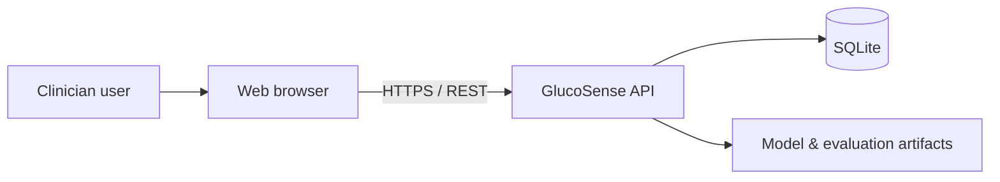
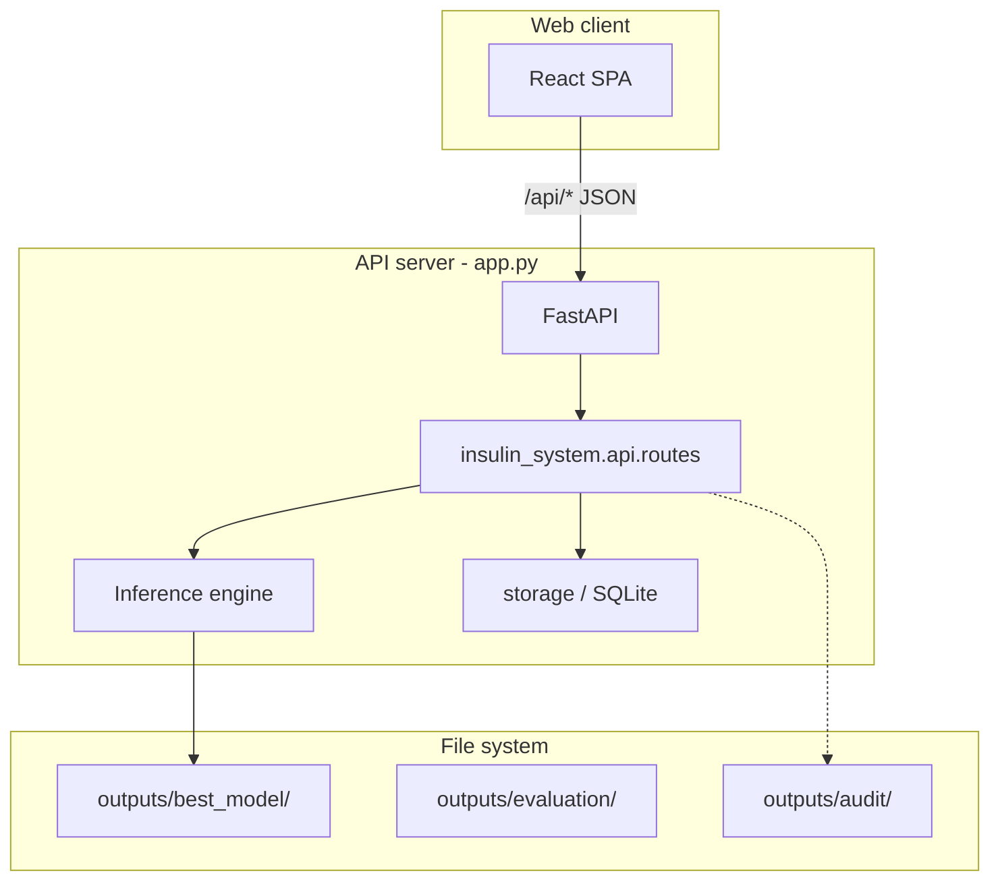
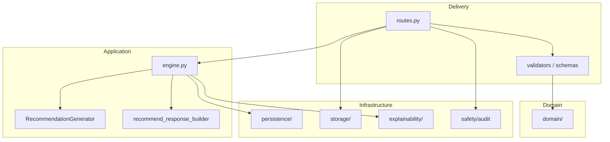
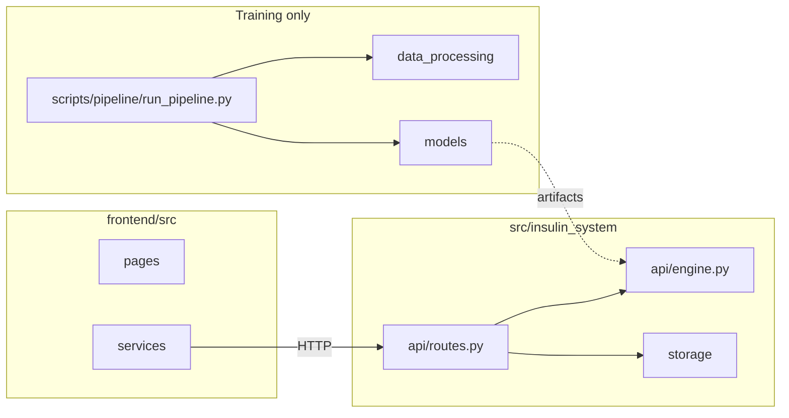

# GlucoSense — System structure, design & architecture

This document describes **GlucoSense Clinical Support** using a **modern, industry-aligned** view: **C4-style context/containers**, **layered / hexagonal mapping**, **data flows**, and **repository layout**. It reflects the **current codebase** in this repository and notes **intentional vs legacy** parts.

**Related docs:** [README.md](../README.md), [RUN.md](RUN.md), [GLUCOSENSE_SYSTEM_DOCUMENTATION.md](GLUCOSENSE_SYSTEM_DOCUMENTATION.md) (if present). **Whole workspace pipeline:** [../../../SYSTEM_PIPELINE.md](../../../SYSTEM_PIPELINE.md).

---

## 1. System context (C4 Level 1)

**GlucoSense** is a **clinical decision support (CDS)** system for **Type 1 diabetes insulin guidance**: it **does not** replace clinician judgment; it **assists** with prediction, recommendation text, and explainability.



| Actor / system | Role |
|----------------|------|
| **Clinician** | Enters assessment data, reviews recommendation, records dose/feedback. |
| **Web UI** | React SPA (`frontend/`) — dashboard, patients, trends, records, model info. |
| **API** | FastAPI application (`app.py`) — `/api/*` REST, validation, inference orchestration. |
| **SQLite** | Operational data: patients, assessments, glucose readings, alerts, settings, backups metadata. |
| **Artifacts** | Trained `InferenceBundle` under `outputs/best_model/`, plots under `outputs/evaluation/`, audit logs. |

---

## 2. Containers (C4 Level 2)

**Production-style** deployment is **two runtime containers** (logical; can run on one host):

| Container | Technology | Responsibility |
|-----------|------------|----------------|
| **Web client** | React 18 + Vite | UI, routing, calls `/api/*` via dev proxy or same-origin when API serves `frontend/dist`. |
| **API server** | FastAPI + Uvicorn | HTTP API, auth middleware (optional API key), static mount optional, orchestrates ML + persistence. |



**Development:** Vite dev server (`localhost:5173`) **proxies** `/api` and `/static` to `http://127.0.0.1:8000` — see `frontend/vite.config.js`.

**Single FastAPI app:** The React dashboard uses **`backend/app.py`** (importable as `app:app` via the root shim) and **`backend/src/insulin_system/api/routes.py`**. The old duplicate **`backend/main.py`** cohort-only API was **removed** to avoid confusion.

---

## 3. Backend logical architecture (modern layered view)

The Python package **`src/insulin_system/`** maps cleanly to **hexagonal / clean architecture** layers:

| Layer | Packages / modules | Responsibility |
|-------|-------------------|----------------|
| **Delivery (adapters in)** | `api/` (`routes.py`, `validators.py`, `schemas.py`) | HTTP, request/response DTOs, status codes, wiring to application services. |
| **Application** | `api/engine.py`, `recommendation/`, parts of `api/*_helpers.py` | Use cases: predict, explain, recommend; orchestrate model + rules + explanation. |
| **Domain** | `domain/` | Validation rules, constants — pure domain concepts. |
| **Infrastructure (adapters out)** | `persistence/` (load bundle), `storage/` (SQLite), `explainability/`, `monitoring/`, `safety/` | DB, files, SHAP, audit, metrics. |
| **ML training / batch** | `data_processing/`, `models/`, `run_*.py` at repo root | Offline pipeline — not required at request time except that **artifacts must exist**. |



**Design strengths (already aligned with modern practice):**

- **Thin controllers** (`routes.py`) delegating to **`engine`** and **storage**.
- **Explicit persistence boundary** (`storage/` + `persistence/`).
- **Safety / audit** separated (`safety/`).
- **Pydantic / validation** at the edge (`validators`, `schemas`).

**Improvement opportunities (optional roadmap):**

- Rename or group `api/` into `interfaces/http/` vs `application/` if the team wants stricter folder semantics.
- Single entrypoint: **`app.py`** (shim) → **`backend/app.py`** (FastAPI).

---

## 4. Frontend structure (current + recommended evolution)

### 4.1 Current layout (feature-oriented, good baseline)

```
frontend/src/
├── main.jsx              # Bootstrap, API health gate
├── App.jsx               # Routes
├── api.js                # fetch wrapper (e.g. ngrok header)
├── constants.js
├── context/              # ClinicalContext
├── pages/                # Route-level screens
├── components/           # Shared + feature folders (dashboard/, patients/)
├── services/             # API clients (dashboardApi, clinicalApi, patientsApi)
└── utils/
```

### 4.2 Modern conventions to grow into

| Practice | Application to GlucoSense |
|----------|---------------------------|
| **Feature folders** | Co-locate `Dashboard` subcomponents under `features/dashboard/` if the app grows. |
| **API layer** | Keep **`services/*Api.js`** as the only place that knows paths (`/api/recommend`, …). |
| **State** | Context for selected patient / session; consider React Query later for cache/refetch. |
| **Design system** | Shared tokens in CSS variables or a small UI kit for clinician-grade consistency. |

---

## 5. Key data flows

### 5.1 Recommendation (primary clinical path)

1. UI: user selects **registered patient** + assessment fields → `POST /api/recommend`.
2. API: validate body + `patient_id` exists → `get_bundle()` → `run_recommend()` → persist record → update context / trends / alerts.
3. Response: structured recommendation + disclaimer + explainability fields as implemented.

### 5.2 Model load

- **First request** or **background thread** in `app.py` startup: `get_bundle()` loads **`outputs/best_model/`**.
- **503** if bundle missing — operator runs `run_pipeline.py` or evaluation script (see `RUN.md`).

### 5.3 Audit & safety

- Predictions/recommendations logged (e.g. JSONL under `outputs/audit/` per README).
- Responses carry **clinical disclaimer**; UI should always show it (policy).

---

## 6. Repository layout (reference)

| Path | Purpose |
|------|---------|
| `app.py` | **Primary** FastAPI app: CORS, optional rate limit, includes `insulin_system` router, optional static SPA, model preload. |
| `backend/app.py` | **FastAPI** application used by the React web UI |
| `src/insulin_system/` | Core product logic (API, ML inference, recommendation, explainability, storage). |
| `frontend/` | Clinician React SPA. |
| `outputs/best_model/` | Serialized inference bundle for runtime. |
| `outputs/glucosense.db` | Operational SQLite (see README/RUN.md for paths). |
| `outputs/evaluation/`, `outputs/explainability/` | Training/eval artifacts and plots. |
| `scripts/pipeline/` | Offline ML and pipeline entrypoints (`run_pipeline.py`, `run_evaluation.py`, …). |
| `tests/` | Pytest tests. |
| `docs/notebooks/` | Research / development Jupyter notebooks. |
| `Dockerfile` | Container build for deployment. |
| `docs/` | Architecture and project guides (this file). |

---

## 7. Cross-cutting concerns (modern checklist)

| Concern | Current implementation |
|---------|-------------------------|
| **API contract** | OpenAPI at `/docs`, `/redoc`. |
| **Security** | Optional `GLUCOSENSE_API_KEY`; CORS open in dev — tighten for production. |
| **Observability** | Logging + `monitoring/` stats endpoint; extend with structured logs / tracing as needed. |
| **Configuration** | `DashboardConfig`, env vars — document all production env vars in one place. |
| **Data lifecycle** | SQLite backups via API; document restore procedures. |
| **Clinical governance** | Disclaimers, high-risk flags, audit trail — keep as first-class requirements. |

---

## 8. Diagram: where to edit what



---

## 9. Versioning & evolution

- Treat this document as the **canonical structural view**; when you **merge** with another system (e.g. meal-plan app), add a **new section**: “Integration boundaries” (identity, glucose sync, BFF vs direct API calls).

---

*Last updated: aligned with repository layout and `app.py` + `src/insulin_system` + `frontend` as of document creation.*
