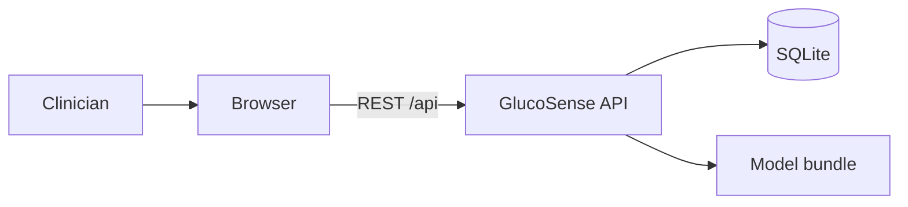
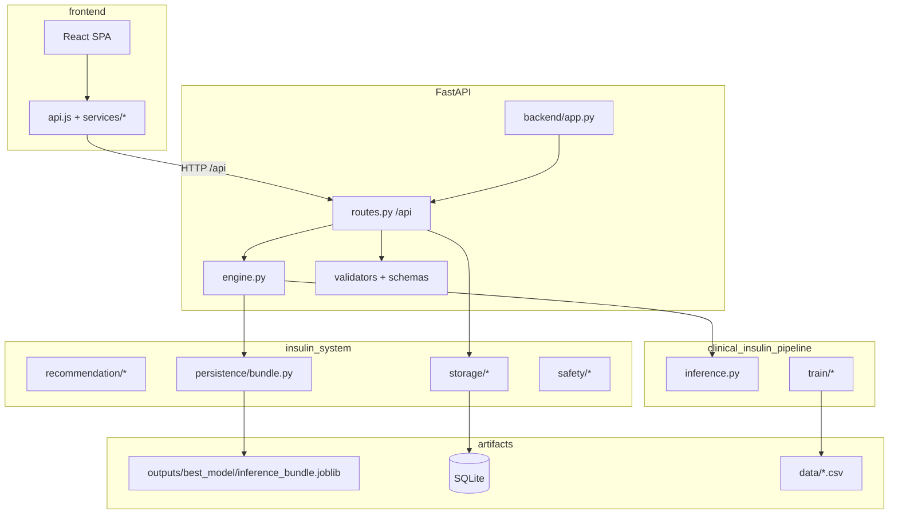
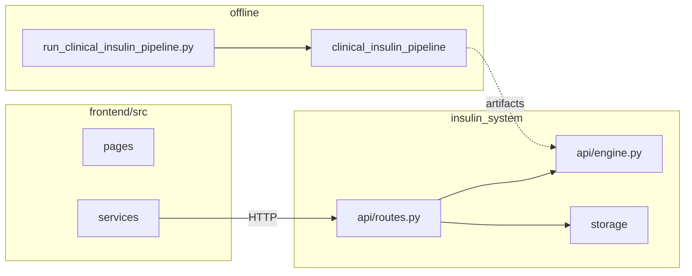

# Clinical-Insulin-Recommendation — design, structure & flows

Single reference for **layout**, **layers**, **CDS context**, **assessment → dose inference**, and **where to change code**. For **how to run** commands, see [RUN.md](./RUN.md). For **DB seed and training artifacts**, see [PIPELINE.md](./PIPELINE.md). Workspace-wide (Meal Plan integration): [../../../SYSTEM_PIPELINE.md](../../../SYSTEM_PIPELINE.md).

### Technology stack (summary)

| Layer | Stack | Role in this repo |
|-------|--------|-------------------|
| HTTP | FastAPI, Uvicorn | `backend/app.py` mounts `insulin_system.api.routes` at `/api` |
| Validation | Pydantic | `api/schemas.py`, `api/validators.py` |
| Inference | joblib bundle, NumPy/pandas | `persistence/bundle.py` + `clinical_insulin_pipeline/inference.py` |
| Data | SQLite | `storage/db.py` — patients, records, glucose, doses, alerts |
| UI | React 18, Vite, React Router | `frontend/src` — workspace, assessment, meal embed |
| Config | JSON + env | `config/*.json`, `GLUCOSENSE_*` |

---

## 1. What this subsystem is

| Concern | Implementation |
|--------|----------------|
| **Web API** | FastAPI in `backend/app.py`, routes under `/api` |
| **Clinical UI** | React 18 + Vite in `frontend/` (proxies `/api` → backend `:8000` in dev) |
| **Runtime inference** | `insulin_system.api.engine` loads `InferenceBundle` and runs `clinical_insulin_pipeline.inference.predict_insulin_dose` (IU regression) |
| **Offline ML** | `clinical_insulin_pipeline/` — train/evaluate; artifacts → `outputs/clinical_insulin_pipeline/latest/` |
| **App state** | SQLite via `insulin_system.storage` |

**Root entrypoints**

| File | Role |
|------|------|
| `run_clinical_insulin_pipeline.py` | Delegates to `scripts/pipeline/run_clinical_insulin_pipeline.py` |
| `app.py` (repo root) | Shim so `uvicorn app:app` works from repo root |

Use **`backend/app.py`** as the only FastAPI app (there is no `backend/main.py`).

---

## 2. System context (C4-style)

**GlucoSense** is **clinical decision support (CDS)** for Type 1–oriented insulin guidance: it **assists**; it does not replace clinician judgment.



| Container | Technology | Responsibility |
|-----------|------------|----------------|
| **Web client** | React + Vite | UI, `/api/*` via dev proxy or same-origin static |
| **API server** | FastAPI + Uvicorn | REST, validation, inference, persistence |

---

## 3. Layered / hexagonal mapping

| Layer | Location | Responsibility |
|-------|----------|----------------|
| **Delivery** | `api/routes.py`, `schemas.py`, `validators.py` | HTTP, DTOs, status codes |
| **Application** | `api/engine.py`, `recommendation/`, `api/recommend_response_builder.py`, `api/helpers/` | Predict / recommend / explain orchestration |
| **Domain** | `domain/` | Constants, validation rules |
| **Infrastructure** | `persistence/`, `storage/`, `safety/`, `monitoring/` | Bundle I/O, SQLite, audit, metrics |
| **Offline ML** | `clinical_insulin_pipeline/` | Training; artifacts consumed via bundle paths |



---

## 4. Repository tree (physical)

```
Clinical-Insulin-Recommendation/
├── app.py
├── run_clinical_insulin_pipeline.py
├── requirements.txt
├── pytest.ini
├── backend/
│   ├── app.py
│   └── src/
│       ├── insulin_system/
│       └── clinical_insulin_pipeline/
├── frontend/
│   └── src/ …
├── data/
├── outputs/
├── config/
├── scripts/
├── tests/
└── docs/
    ├── DESIGN_STRUCTURE.md   ← this file
    ├── README.md
    ├── RUN.md
    ├── PIPELINE.md
    ├── CDS_SAFETY_ENGINE.md
    ├── UGANDA_T1D_GUIDELINES.md
    └── notebooks/README.md
```

---

## 5. Backend package: `insulin_system`

Python path: `backend/src` on `sys.path`; imports `insulin_system.*`, `clinical_insulin_pipeline.*`.

| Area | Path | Responsibility |
|------|------|----------------|
| **HTTP surface** | `api/routes.py` | `/api/*`: predict, explain, recommend, patients, glucose, dose, alerts, feedback, backups, settings |
| **Inference** | `api/engine.py` | `get_bundle`, `run_predict`, `run_recommend`, `get_model_info`, `get_feature_importance` |
| **Contracts** | `api/schemas.py`, `api/validators.py` | Pydantic; validation → `PatientInput` / DataFrame |
| **Response assembly** | `api/recommend_response_builder.py` | Structured recommendation payload |
| **Helpers** | `api/helpers/` | Alerts, trends, patient context, `clinical_bridge`, `clinical_narrative`, SHAP background, route data |
| **Bundle I/O** | `persistence/bundle.py` | `InferenceBundle`, `load_best_model`, path resolution |
| **Recommendation text** | `recommendation/` | Generator, explanations, prediction helpers |
| **SQLite** | `storage/` | `db.py`, `patients.py`, `seed_data.py`, `repositories.py`, `backup.py` |
| **Configuration** | `config/schema.py`, `clinical_config.py` | Zones, thresholds, `DashboardConfig` |
| **Domain** | `domain/` | `constants.py`, `validation.py` |
| **Safety & audit** | `safety/` | `audit.py`, `disclaimer.py` |
| **Monitoring** | `monitoring/` | Stats endpoints |
| **Dashboard** | `dashboard/data_loader.py` | Dashboard-oriented data |
| **Exceptions** | `exceptions.py` | Shared errors |

---

## 6. Package: `clinical_insulin_pipeline`

| Area | Path | Responsibility |
|------|------|----------------|
| **Data / features** | `data/`, `preprocessing/` | CSV load, features, transforms |
| **Models & training** | `models/`, `training.py`, `train/` | Fit, CV, export |
| **Evaluation** | `evaluation/*` | Metrics, SHAP, plots |
| **Inference** | `inference.py` | `predict_insulin_dose(bundle, row)` |
| **CLI** | `cli.py`, `run_clinical_insulin_pipeline.py` | Offline runs |

---

## 7. Paths: assessment → dose → response

1. **UI** — Dashboard / assessment form collects fields (e.g. age, gender, `glucose_level`, `food_intake`, `previous_medications`; optional BMI, HbA1c, weight). Client validation in components; `POST /api/recommend` with `patient_id` + body.
2. **API** — `validate_patient_input` → errors return **422**. `domain/validation.py` may sanitize; `patient_input_to_dataframe` builds a row.
3. **Engine** — `get_bundle()` loads joblib (`outputs/best_model/` or `GLUCOSENSE_INFERENCE_BUNDLE` or compatible pipeline output).
4. **Model** — `predict_insulin_dose` returns a **dose (IU)**. Helpers map dose → display tier / narrative; optional uncertainty / feature narrative via `clinical_narrative` / SHAP when configured.
5. **Side effects** — `insert_record`, glucose for trends, patient context, `check_critical_alerts` where applicable; `log_prediction` / audit.

Required vs optional fields for assessment are enforced in validators and domain rules; see `api/validators.py` and `domain/validation.py` for the source of truth.

---

## 8. Frontend structure

| Kind | Location | Notes |
|------|----------|--------|
| **Routing** | `App.jsx` | `/`, `/login`, `/meal-plan`, `/workspace/*` nested routes |
| **State** | `context/ClinicalContext.jsx` | Session, role, patients, notifications |
| **API** | `api.js`, `services/*.js` | `/api/recommend`, patients, dashboard |
| **Features** | `components/dashboard/*`, `pages/*` | Assessment, recommendation, trends, patients |
| **Meal embed** | `MealPlanSsoBridge.jsx`, `utils/mealPlanSso.js` | External Meal Plan (env URLs) |

---

## 9. Configuration & artifacts

| Item | Location / variable |
|------|---------------------|
| **API key (optional)** | `GLUCOSENSE_API_KEY` → `X-API-Key` |
| **Bundle override** | `GLUCOSENSE_INFERENCE_BUNDLE` |
| **Default bundle** | `outputs/best_model/inference_bundle.joblib` |
| **Clinical JSON** | `config/clinical_thresholds.json`, `config/uganda_t1d_guidelines.json` |

---

## 10. Where to edit what



---

## 11. Cross-cutting concerns

| Concern | Implementation |
|---------|------------------|
| **API contract** | OpenAPI `/docs`, `/redoc` |
| **Security** | Optional API key; tighten CORS for production |
| **Persistence** | SQLite backups via API; see `storage/backup.py` |
| **Clinical governance** | Disclaimers, audit logging, CDS safety notes in [CDS_SAFETY_ENGINE.md](./CDS_SAFETY_ENGINE.md) |

---

## 12. Tests

| Path | Role |
|------|------|
| `tests/` | Pytest, `conftest.py` |
| `tests/test_clinical_insulin_pipeline.py` | Pipeline tests |

---

## 13. Related docs (this folder)

| File | Use |
|------|-----|
| **[RUN.md](./RUN.md)** | Install, train pipeline, run API + frontend, troubleshooting |
| **[PIPELINE.md](./PIPELINE.md)** | Seed data, DB tables, how training outputs relate to runtime bundle |
| **[CDS_SAFETY_ENGINE.md](./CDS_SAFETY_ENGINE.md)** | CDS safety categories and checks |
| **[UGANDA_T1D_GUIDELINES.md](./UGANDA_T1D_GUIDELINES.md)** | Guideline summary and JSON pointers |
| **[notebooks/README.md](./notebooks/README.md)** | Optional Jupyter; training via pipeline script |

---

*For exact request/response schemas, use the live OpenAPI UI at `http://localhost:8000/docs`.*
