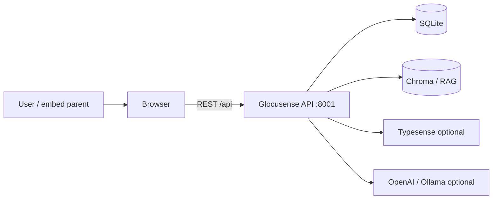

# Meal-Plan-System (Glocusense) — design & structure

Single reference for **layout**, **runtime layers**, **API modules**, and **frontend routing**. For run commands see [guides/HOW_TO_RUN.md](./guides/HOW_TO_RUN.md). For CI/Docker/ML workflow see [PIPELINE.md](./PIPELINE.md). Monorepo integration (GlucoSense + ports): [../../SYSTEM_PIPELINE.md](../../SYSTEM_PIPELINE.md).

### Technology stack (summary)

| Layer | Stack | Role in this repo |
|-------|--------|-------------------|
| HTTP | FastAPI, Uvicorn | `api/main.py` includes domain routers under `/api/*` |
| ORM / DB | SQLAlchemy 2.x, SQLite | `api/models.py`, `api/shared/database.py` |
| Auth | JWT (python-jose / bcrypt, etc.) | `api/modules/auth/` |
| Search | SQLite + fuzzy; optional Typesense | `api/modules/search/` |
| Chatbot | Chroma RAG + embeddings + LLM or legacy | `api/modules/chatbot/` |
| Recommendations | Python engine (scoring, constraints) | `api/modules/recommendations/engine/` |
| UI | React, Vite, React Router | `frontend/src` — auth routes + `/app/*` shell |
| Offline ML | `models/`, `ml-services/` | Training/experiments; not required for API runtime |

---

## 1. What this subsystem is

| Concern | Implementation |
|--------|----------------|
| **Web API** | FastAPI — `backend/api/main.py`, routers under `/api/*` |
| **Web UI** | React 18 + Vite — `frontend/` (dev **5175**; proxies `/api` → meal API, default **8001**) |
| **Data** | SQLAlchemy + **SQLite** (path configurable; Docker may use `/data/*.db`) |
| **Core features** | JWT **auth**, **food search** (SQLite + fuzzy; optional **Typesense**), **RAG chatbot** (Chroma + embeddings + OpenAI/Ollama or legacy rule fallback), **meal recommendations** (constraint/scoring engine), **glucose** logging API, **sensor demo** CSV API for charts |
| **Offline ML** | `models/` (notebooks, `scripts/run_pipeline.py`) — not imported by the live API unless explicitly wired |
| **Optional** | `ml-services/` — auxiliary Python utilities, not the main API process |

---

## 2. System context



**Integrated mode:** GlucoSense hosts an **iframe** to this app’s origin and exchanges a **JWT** via embed SSO (`GLUCOSENSE_EMBED_KEY` / meal auth). The meal API stays on **8001** so it does not collide with GlucoSense **8000**.

---

## 3. Backend architecture

### 3.1 Entry & lifespan

| Piece | Path | Role |
|-------|------|------|
| **Uvicorn** | `backend/run.py` | `api.main:app`, default **PORT=8001** |
| **App factory** | `api/main.py` | `FastAPI`, CORS, `lifespan`: `init_db()` then **background** `_seed_worker` (foods CSV, fallback seed, `build_rag_store`, optional Typesense sync) |

Startup **does not block HTTP** on full RAG build; heavy work runs in a daemon thread.

### 3.2 Routers (prefix → module)

| Prefix | Module | Responsibility |
|--------|--------|----------------|
| `/api/auth` | `api/modules/auth/` | Register, login, JWT, onboarding, **embed token** for GlucoSense iframe |
| `/api/search` | `api/modules/search/` | Food search; `typesense_search.py` when `TYPESENSE_*` set |
| `/api/chatbot` | `api/modules/chatbot/` | Sessions, RAG (`rag_chat.py`, `rag_store.py`), `llm_client`, `response_builder`, `topic_nlp` |
| `/api/recommendations` | `api/modules/recommendations/` | Meal plan recommendations; **`engine/`** pipeline (pools, scoring, optimization, constraints, explainability) |
| `/api/glucose` | `api/modules/glucose/` | Glucose CRUD + repository |
| `/api/sensor-demo` | `api/modules/sensor_demo/` | Demo **SmartSensor** CSV: meta, patients, series, summary (JWT) |

Health: `GET /health`, `GET /api/health` — identifies **`glocusense-meal-plan`** (see `main.py`).

### 3.3 Shared & core

| Path | Role |
|------|------|
| `api/shared/database.py` | Engine, `init_db`, `SessionLocal`, session dependency |
| `api/shared/dependencies.py` | FastAPI `Depends` helpers |
| `api/database.py` | Compatibility / re-exports (if present) |
| `api/models.py` | SQLAlchemy models |
| `api/core/config.py` | Settings |
| `api/core/exceptions.py`, `logging_config.py` | Errors, logging |
| `api/utils/seed.py` | `load_foods_from_csv`, `seed_fallback`, `build_rag_store` |

### 3.4 Recommendations engine (`api/modules/recommendations/engine/`)

| File | Role |
|------|------|
| `pipeline.py` | Orchestrates recommendation generation |
| `pools.py`, `pool_cache.py` | Meal/food pool construction |
| `scoring.py` | Rank candidates |
| `optimization.py` | Selection under constraints |
| `constraints.py` | Diet / nutrition bounds |
| `context_model.py` | User/context state for scoring |
| `meal_guidance.py` | Guidance text / rules |
| `explainability.py` | Human-readable factors |

`service.py` wires router → engine; `feedback_repository.py` stores user feedback.

---

## 4. Repository tree (physical)

```
Meal-Plan-System/
├── run.py                    # → backend/run.py
├── requirements.txt          # -r backend/requirements.txt
├── pyproject.toml            # pytest paths
├── docker/
│   ├── Dockerfile.api
│   ├── Dockerfile.web
│   └── nginx-meal.conf
├── backend/
│   ├── run.py
│   ├── requirements.txt
│   ├── api/
│   │   ├── main.py
│   │   ├── models.py
│   │   ├── core/
│   │   ├── shared/
│   │   ├── modules/
│   │   │   ├── auth/
│   │   │   ├── search/
│   │   │   ├── chatbot/
│   │   │   ├── recommendations/
│   │   │   ├── glucose/
│   │   │   └── sensor_demo/
│   │   └── utils/seed.py
│   ├── tests/
│   ├── scripts/              # seed_foods, seed_test_user, extract_prompt_pdf
│   ├── database/             # migrations, DBA notes
│   └── datasets/             # food CSVs for seed
├── frontend/
│   ├── vite.config.js        # port 5175, proxy /api
│   └── src/
│       ├── App.jsx
│       ├── main.jsx
│       ├── lib/api.js
│       ├── context/AuthContext.jsx
│       ├── components/layout/, components/ui/
│       ├── pages/auth/       # Landing, Login, Register
│       └── pages/app/        # Dashboard, Chatbot, Glucose, MealPlan, Onboarding
├── models/                   # offline ML — scripts/, notebooks/, output/
├── ml-services/              # optional standalone Python
├── scripts/                  # start_full_system.ps1, ci.ps1 / ci.sh
└── docs/
    ├── DESIGN_STRUCTURE.md   # this file
    ├── PIPELINE.md
    ├── README.md
    ├── guides/
    └── architecture/         # ER diagrams, vector notes (see §6)
```

---

## 5. Data & persistence

| Topic | Detail |
|-------|--------|
| **Pattern** | Router → **service** → **repository** (per domain where used) |
| **ORM** | `backend/api/models.py`; tables created via `init_db()` |
| **SQLite** | Path from `DATABASE_URL` / `api/core/config.py` (e.g. on Windows often under `%LocalAppData%\Glocusense\`; Linux/mac may use `backend/instance/` — gitignored) |
| **Seed** | `backend/datasets/*.csv` + `api/utils/seed.py` (runs in background after `init_db`) |

---

## 6. Directory reference (detailed)

| Area | Path | Purpose |
|------|------|---------|
| **Backend** | `backend/` | FastAPI: `run.py`, `api/`, `requirements.txt`, `tests/` |
| **Frontend** | `frontend/` | Vite SPA only (`npm run dev` → **5175**) |
| **ML / research** | `ml-services/`, `models/` | Optional; not wired into live API by default — see `models/README.md` |
| **Automation** | `scripts/` | `start_full_system.ps1`, `ci.ps1` / `ci.sh` |
| **Containers** | `docker/` | `Dockerfile.api`, `Dockerfile.web`, `nginx-meal.conf` |

| Path under `backend/` | Purpose |
|----------------------|---------|
| `api/` | `main.py`, `models.py`, `core/`, `shared/`, `modules/*`, `utils/seed.py` |
| `tests/` | Pytest (`pyproject.toml` at repo root) |
| `scripts/` | `seed_foods.py`, `seed_test_user.py`, `extract_prompt_pdf.py` |
| `database/` | SQL migrations / DBA reference |
| `datasets/` | Food CSVs for seed |
| `instance/` | Local SQLite on some platforms (gitignored) |
| `docker-compose.yml` | Optional Postgres / Redis / Elasticsearch |
| `docker-compose.typesense.yml` | Optional Typesense for search |

| Path under `frontend/` | Purpose |
|-------------------------|---------|
| `src/` | `App.jsx`, `main.jsx`, `lib/api.js`, `context/`, `pages/auth/`, `pages/app/`, `components/` |
| `docs/` (in `frontend/`) | `UI_DESIGN_GUIDE.md` |

| Path under `models/` | Purpose |
|----------------------|---------|
| `scripts/` | e.g. `run_pipeline.py` → `models/output/` |
| `notebooks/` | Jupyter |
| `output/` | Plots, `.joblib` (local, gitignored) |

**Repository scope:** **Web-only** (no mobile app in this repo). Legacy stubs (`ml-api/`, duplicate Node `backend/`, etc.) were removed earlier.

**Do not commit:** `venv/`, `node_modules/`, `dist/`, `logs/`, `.env`, `__pycache__/`, `backend/instance/*.db`, coverage outputs — see root `.gitignore`.

---

## 7. Root convenience shims

| File | Role |
|------|------|
| `run.py` | Delegates to `backend/run.py` |
| `requirements.txt` | Includes `backend/requirements.txt` |
| `pyproject.toml` | Pytest `testpaths` / `pythonpath` for `backend/tests` |

---

## 8. Optional infrastructure

| File | Purpose |
|------|---------|
| `backend/docker-compose.yml` | Local Postgres, Redis, Elasticsearch (optional) |
| `backend/docker-compose.typesense.yml` | Typesense for food search — [guides/TYPESENSE.md](./guides/TYPESENSE.md) |
| `docker/Dockerfile.*` | Production-like API and web images — [PIPELINE.md](./PIPELINE.md) |

---

## 9. Request flow (typical)

**Example — registration**

1. Browser `POST /api/auth/register` → Vite proxy → `api/modules/auth/router.py`.
2. Service validates, hashes password, persists user, returns JWT + user JSON.
3. Frontend stores token (e.g. `localStorage`); `AuthContext` holds user state.

**Other flows**

1. **Auth:** Login or embed token handoff from GlucoSense parent → JWT.
2. **Search:** `GET/POST /api/search/...` → SQLite and/or Typesense.
3. **Chatbot:** `POST /api/chatbot/message` → RAG + LLM or legacy builder.
4. **Recommendations:** Goals/constraints → `recommendations` **engine** → ranked meals + explanations.
5. **Glucose:** `/api/glucose` CRUD as implemented.

---

## 10. Frontend structure

| Area | Path | Role |
|------|------|------|
| **Routes** | `App.jsx` | `/` landing, `/login`, `/register`; `/app/*` requires auth + onboarding |
| **Shell** | `components/layout/Layout.jsx` | Nav for authenticated app |
| **Auth state** | `context/AuthContext.jsx` | User, JWT, **embed handoff** from GlucoSense `postMessage` |
| **HTTP** | `lib/api.js` | Base URL `/api` (Vite proxy in dev) |
| **App pages** | `pages/app/` | Dashboard, Chatbot, Glucose, MealPlan, Onboarding |
| **Auth pages** | `pages/auth/` | Landing, Login, Register |
| **Styles** | `styles/index.css` | Global CSS |

**Redirects:** `/app/search` and `/app/recommendations` → `/app/meal-plan` (single meal-plan experience).

---

## 11. Configuration (selected env)

| Variable | Purpose |
|----------|---------|
| `PORT` | API port (default **8001**) |
| `JWT_SECRET` | Signing JWTs |
| `GLUCOSENSE_EMBED_KEY` | Shared secret for iframe SSO with GlucoSense |
| `OPENAI_API_KEY` / `OLLAMA_HOST` | LLM for chatbot |
| `TYPESENSE_HOST` (+ key) | Optional search index |
| `CHATBOT_USE_LEGACY_ONLY` | Force non-LLM chatbot |
| `CORS_EXTRA_ORIGINS` | Extra allowed origins |
| `SMART_SENSOR_CSV_PATH` | Override CSV for sensor-demo |

See `backend/.env.example` and [guides/CHATBOT.md](./guides/CHATBOT.md), [guides/TYPESENSE.md](./guides/TYPESENSE.md).

---

## 12. Tests

| Path | Role |
|------|------|
| `backend/tests/` | `pytest` — API tests (`test_api.py`, `conftest.py`) |
| `frontend/` | Vitest config under `src/test/` |

Run from repo root per `pyproject.toml`.

---

## 13. Related docs (this repo)

| File | Use |
|------|-----|
| [PIPELINE.md](./PIPELINE.md) | Dev workflow, CI, Docker, offline ML |
| [guides/HOW_TO_RUN.md](./guides/HOW_TO_RUN.md) | Commands & troubleshooting |
| [guides/CHATBOT.md](./guides/CHATBOT.md) | RAG + LLM behaviour |
| [guides/TYPESENSE.md](./guides/TYPESENSE.md) | Search index setup |
| [../frontend/docs/UI_DESIGN_GUIDE.md](../frontend/docs/UI_DESIGN_GUIDE.md) | UI conventions |
| [architecture/ER_DIAGRAM.md](./architecture/ER_DIAGRAM.md) | ER / schema notes |
| [architecture/VECTOR_DB_SCHEMA.md](./architecture/VECTOR_DB_SCHEMA.md) | Vector store notes |

---

*For exact request/response shapes, use the running OpenAPI UI at `http://127.0.0.1:8001/docs` (or your configured `PORT`).*
