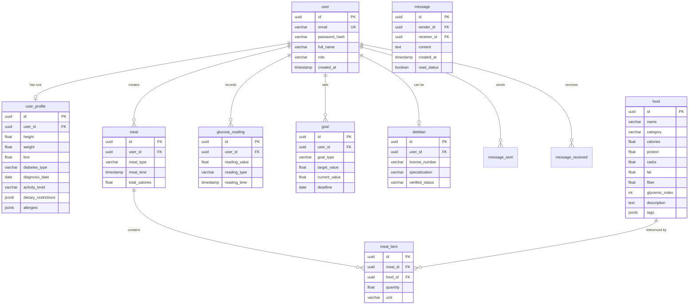

# Smart Diabetes Nutrition & Monitoring Platform
## Entity-Relationship Diagram & Database Design

### ER Diagram (Mermaid)



### Cardinality Summary

| Relationship | Cardinality | Cascade Rule |
|-------------|-------------|--------------|
| User to UserProfile | 1:1 | CASCADE on delete |
| User to Meal | 1:N | CASCADE on delete |
| User to GlucoseReading | 1:N | CASCADE on delete |
| User to Goal | 1:N | CASCADE on delete |
| User to Dietitian | 1:1 | CASCADE on delete |
| User to Message (sender) | 1:N | SET NULL on delete |
| User to Message (receiver) | 1:N | SET NULL on delete |
| Meal to MealItem | 1:N | CASCADE on delete |
| Food to MealItem | 1:N | RESTRICT (food cannot be deleted if in meals) |

### Naming Conventions

- **Tables**: snake_case, singular (e.g., user, food, glucose_reading)
- **Columns**: snake_case
- **Primary keys**: id (UUID v4)
- **Foreign keys**: {table_singular}_id (e.g., user_id, food_id)
- **Timestamps**: created_at, updated_at

### Index Strategy

| Table | Index | Type | Purpose |
|-------|-------|------|---------|
| user | email | UNIQUE | Login lookup |
| user_profile | user_id | UNIQUE FK | 1:1 join |
| glucose_reading | (user_id, reading_time) | COMPOSITE | Date-range queries |
| glucose_reading | reading_time | BTREE | Time-series analytics |
| meal | (user_id, meal_time) | COMPOSITE | User meal history |
| meal_item | meal_id | BTREE | Meal composition |
| food | category | BTREE | Category filtering |
| food | glycemic_index | BTREE | GI-based filtering |
| goal | (user_id, goal_type) | COMPOSITE | Active goals |
| message | (sender_id, receiver_id, created_at) | COMPOSITE | Conversation threads |

### Partial Indexes

```sql
-- Active goals only
CREATE INDEX idx_goal_active ON goal(user_id, deadline) 
WHERE deadline >= CURRENT_DATE;

-- Recent glucose readings (last 90 days)
CREATE INDEX idx_glucose_recent ON glucose_reading(user_id, reading_time DESC) 
WHERE reading_time >= NOW() - INTERVAL '90 days';
```
