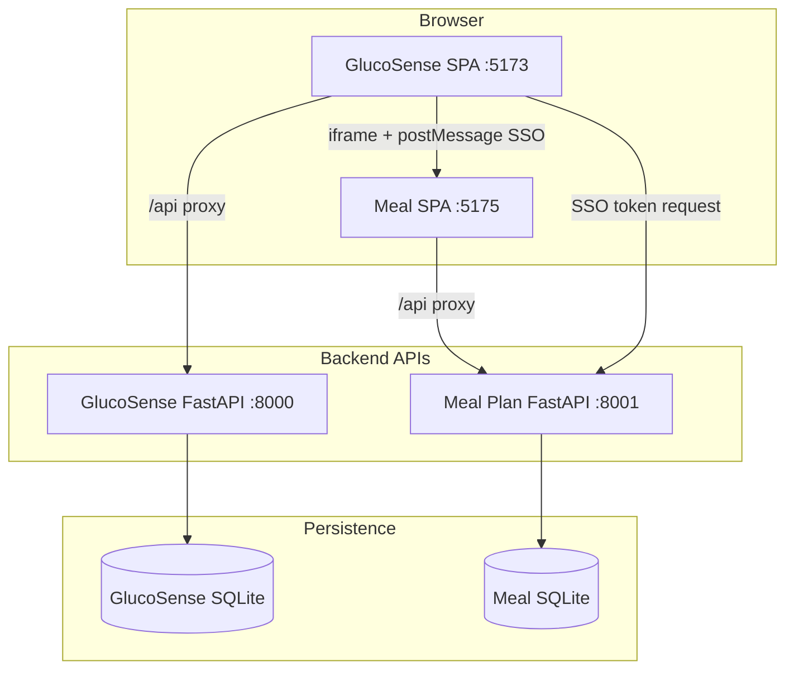
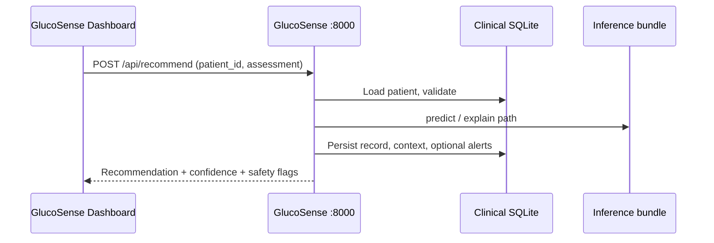
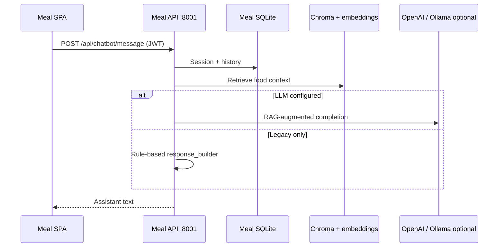

# Integrated system and application pipeline

This document is the **single map** for how the GlucoSense + Meal Plan workspace runs end to end: what starts when, which APIs and databases are involved, how users and data move through the stack, and how **offline ML** relates to **runtime inference**. For component detail, see **[ARCHITECTURE.md](./ARCHITECTURE.md)**.

---

## 1. What this workspace contains

| Layer | Location | Role |
|--------|-----------|------|
| **GlucoSense portal** | `Clinical-Insulin-Recommendation/frontend/` | Clinician workspace, patient meal shell, dashboard embed |
| **GlucoSense clinical API** | `Clinical-Insulin-Recommendation/backend/` (`app.py`, `insulin_system/`) | CDS: patients, recommend, explain, trends, alerts |
| **Meal Plan API** | `Meal-Plan-System/backend/` | Auth, foods, chatbot, recommendations, glucose log, sensor demo |
| **Meal Plan UI** | `Meal-Plan-System/frontend/` | Standalone SPA; same app embedded in GlucoSense |
| **Clinical insulin pipeline (offline)** | `Clinical-Insulin-Recommendation/backend/src/clinical_insulin_pipeline/` | Dose regression (0–10 IU) on `data/SmartSensor_DiabetesMonitoring.csv`; writes `outputs/clinical_insulin_pipeline/latest/` |

---

## 2. Runtime application pipeline (development)

Typical ports (see root **[README.md](./README.md)**):



### 2.1 Startup order

1. **Meal Plan API** (`PORT=8001`, `Meal-Plan-System/.../backend`) — must be up before SSO and embed need tokens.
2. **GlucoSense** — `npm run start` from `Clinical-Insulin-Recommendation/frontend` starts **Uvicorn :8000** and **Vite** (5173 or next free port).
3. **Meal Plan UI** — Vite on **5175** (or value in `VITE_MEAL_PLAN_URL`).

### 2.2 Configuration handoff

| Concern | Where |
|---------|--------|
| Iframe URL | GlucoSense `frontend/.env`: `VITE_MEAL_PLAN_URL` |
| SSO / embed | `VITE_MEAL_PLAN_API_URL` → meal API; shared secret `GLUCOSENSE_EMBED_KEY` / `VITE_MEAL_PLAN_EMBED_SECRET` |
| Meal CORS | `CORS_EXTRA_ORIGINS` for GlucoSense Vite origins |

### 2.3 Request-level pipeline (clinician recommend)



### 2.4 Request-level pipeline (meal chatbot)



### 2.5 Smart Sensor demo (meal API)

Authenticated calls to **`/api/sensor-demo/*`** read **`SmartSensor_DiabetesMonitoring.csv`** (path `SMART_SENSOR_CSV_PATH`). The Meal UI route **`/app/smart-sensor`** charts this data. This path is **not** the same as the GlucoSense clinical recommend engine.

---

## 3. Offline / training pipelines

### 3.1 Clinical insulin pipeline (GlucoSense)

**Purpose:** Train/evaluate **insulin dose regression** (Uganda-oriented spec: 0–10 IU, cyclical time features, robust preprocessing, model zoo, metrics, optional SHAP). Implementation: **`backend/src/clinical_insulin_pipeline/`**.

**Run (from `Clinical-Insulin-Recommendation` root):**

```bash
python run_clinical_insulin_pipeline.py
```

**Faster local run** (skips learning curve and SHAP):

```bash
python run_clinical_insulin_pipeline.py --skip-learning-curve --skip-shap
```

**Outputs:** `outputs/clinical_insulin_pipeline/latest/` — leaderboard, `insulin_regression_bundle.joblib`, plots, metadata.

### 3.2 GlucoSense API inference bundle

**Purpose:** The FastAPI CDS path loads an **`InferenceBundle`** from **`outputs/best_model/`** when **`inference_bundle.joblib`** is present (`load_best_model`). That format is the **legacy** insulin-system bundle; wiring the new regression bundle into **`POST /api/recommend`** is a separate integration step.

**Data file:** `DashboardConfig` / docs use **`data/SmartSensor_DiabetesMonitoring.csv`** as the default training CSV path.

### 3.3 Meal Plan API first boot

On meal API lifespan: **`init_db()`**, seed foods, build **Chroma** vector store (sentence-transformers) unless disabled. This is independent of GlucoSense training.

---

## 4. Data artifacts (quick reference)

| Artifact | Typical path |
|----------|----------------|
| Smart Sensor CSV (GlucoSense data dir) | `Clinical-Insulin-Recommendation/data/SmartSensor_DiabetesMonitoring.csv` |
| Smart Sensor CSV (meal sensor demo) | `Meal-Plan-System/.../backend/datasets/SmartSensor_DiabetesMonitoring.csv` |
| GlucoSense API bundle (optional) | `Clinical-Insulin-Recommendation/outputs/best_model/` |
| Clinical insulin pipeline run | `Clinical-Insulin-Recommendation/outputs/clinical_insulin_pipeline/latest/` |
| Meal optional LLM supplement | `Meal-Plan-System/.../backend/knowledge/clinical_prompt_supplement.txt` |

---

## 5. Docker pipeline (production-like)

See **[DEPLOY.md](./DEPLOY.md)**. Compose builds three images; browser hits **8080** (GlucoSense), iframe/SSO use **8081/8082**. **Model training is not part of the container start**; bundles must be built offline (or copied into image/volume) before expecting specific inference behaviour.

---

## 6. Document map (this repo)

| Document | Use when you need… |
|----------|-------------------|
| **[README.md](./README.md)** | Start servers, ports, first-time install |
| **[ARCHITECTURE.md](./ARCHITECTURE.md)** | Component breakdown, integration table |
| **SYSTEM_PIPELINE.md** (this file) | End-to-end flows: runtime + ML + data |
| **[DEPLOY.md](./DEPLOY.md)** | Docker, HTTPS, secrets |
| `Clinical-Insulin-Recommendation/docs/PIPELINE.md` | GlucoSense API vs DB request flow |
| `Clinical-Insulin-Recommendation/docs/RUN.md` | Deep runbook for GlucoSense only |
| `Meal-Plan-System/docs/guides/CHATBOT.md` | RAG + LLM env |
| `Meal-Plan-System/.../backend/knowledge/README.md` | Clinical prompt supplement |

---

*Last aligned with the workspace layout under `Clinical-Insulin-Recommendation/` and `Meal-Plan-System/`. OpenAPI: GlucoSense `:8000/docs`, Meal API `:8001/docs`.*
