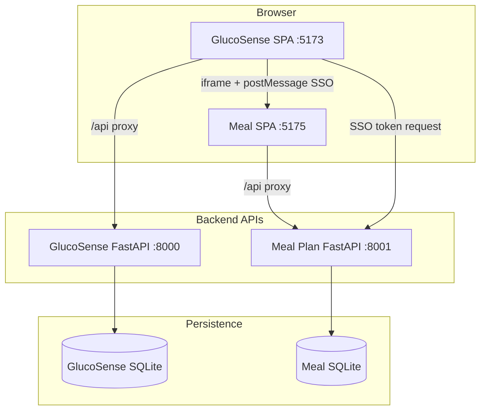
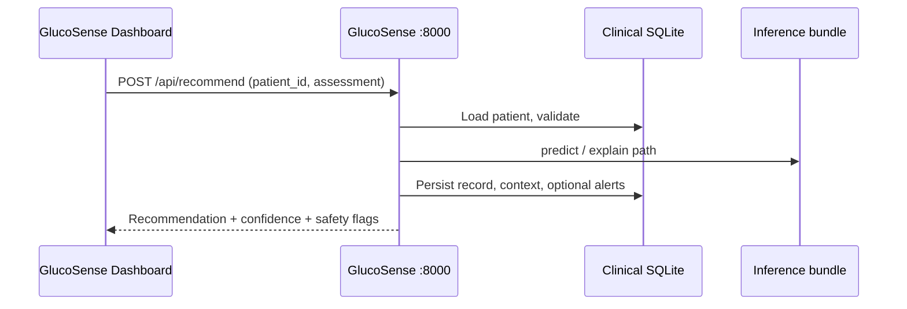
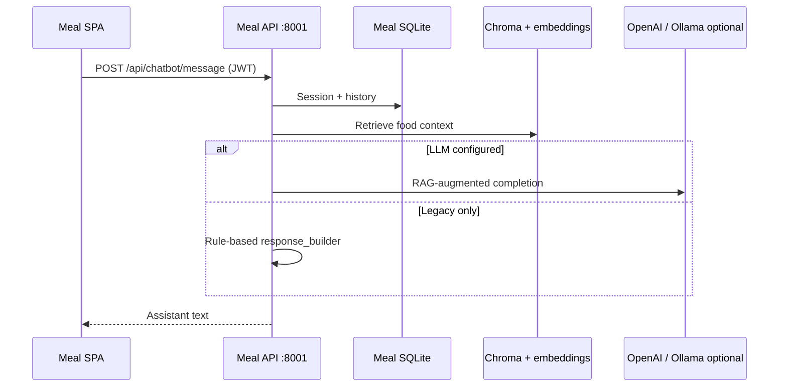

# Integrated system and application pipeline

This document is the **single map** for how the GlucoSense + Meal Plan workspace runs end to end: what starts when, which APIs and databases are involved, how users and data move through the stack, and how **offline ML** relates to **runtime inference**. For component detail, see **[ARCHITECTURE.md](./ARCHITECTURE.md)**.

---

## 1. What this workspace contains

| Layer | Location | Role |
|--------|-----------|------|
| **GlucoSense portal** | `Glucosense/Glucosense/frontend/` | Clinician workspace, patient meal shell, dashboard embed |
| **GlucoSense clinical API** | `Glucosense/Glucosense/backend/` (`app.py`, `insulin_system/`) | CDS: patients, recommend, explain, trends, alerts |
| **Meal Plan API** | `Meal-Plan-System/backend/` | Auth, foods, chatbot, recommendations, glucose log, sensor demo |
| **Meal Plan UI** | `Meal-Plan-System/frontend/` | Standalone SPA; same app embedded in GlucoSense |
| **Smart Sensor ML (offline)** | `Glucosense/Glucosense/backend/src/smart_sensor_ml/` | Train/eval on `data/SmartSensor_DiabetesMonitoring.csv`; PDF + joblib bundle |
| **Clinical ML (offline)** | `Glucosense/Glucosense/scripts/pipeline/`, `backend/src/clinical_ml_pipeline/` | Legacy evaluation / full clinical improvement pipeline (expects legacy CSV schema unless adapted) |

---

## 2. Runtime application pipeline (development)

Typical ports (see root **[README.md](./README.md)**):



### 2.1 Startup order

1. **Meal Plan API** (`PORT=8001`, `Meal-Plan-System/.../backend`) — must be up before SSO and embed need tokens.
2. **GlucoSense** — `npm run start` from `Glucosense/.../frontend` starts **Uvicorn :8000** and **Vite** (5173 or next free port).
3. **Meal Plan UI** — Vite on **5175** (or value in `VITE_MEAL_PLAN_URL`).

### 2.2 Configuration handoff

| Concern | Where |
|---------|--------|
| Iframe URL | GlucoSense `frontend/.env`: `VITE_MEAL_PLAN_URL` |
| SSO / embed | `VITE_MEAL_PLAN_API_URL` → meal API; shared secret `GLUCOSENSE_EMBED_KEY` / `VITE_MEAL_PLAN_EMBED_SECRET` |
| Meal CORS | `CORS_EXTRA_ORIGINS` for GlucoSense Vite origins |

### 2.3 Request-level pipeline (clinician recommend)



### 2.4 Request-level pipeline (meal chatbot)



### 2.5 Smart Sensor demo (meal API)

Authenticated calls to **`/api/sensor-demo/*`** read **`SmartSensor_DiabetesMonitoring.csv`** (path `SMART_SENSOR_CSV_PATH`). The Meal UI route **`/app/smart-sensor`** charts this data. This path is **not** the same as the GlucoSense clinical recommend engine.

---

## 3. Offline / training pipelines

### 3.1 Smart Sensor ML pipeline (Prompt-style end-to-end)

**Purpose:** Train tabular models (and optional LSTM) on the Smart Sensor CSV; produce metrics, plots, PDF report, and a **joblib** bundle for integration experiments.

| Stage | Implementation |
|--------|----------------|
| Load / EDA | `smart_sensor_ml/load_data.py` |
| Validate | `smart_sensor_ml/validate_data.py` |
| Preprocess | `smart_sensor_ml/preprocess.py` (patient groups, no row leakage in split design) |
| Train / evaluate | `train_model.py`, `evaluate_model.py` |
| LSTM | `lstm_sequence.py` (TensorFlow; optional) |
| Report | `outputs/smart_sensor_ml/Smart_Sensor_ML_Report.pdf` |

**Run (from `Glucosense/Glucosense`):**

```bash
python scripts/run_smart_sensor_ml.py --skip-lstm --out outputs/smart_sensor_ml
```

**Outputs:** `model_comparison.csv`, `figures/`, `model_bundle/`, `PIPELINE_STAGES.md`.  
**Note:** LightGBM is opt-in (`SMART_SENSOR_TRY_LGBM=1`) on some Windows/Python builds.

### 3.2 GlucoSense clinical inference bundle (production CDS)

**Purpose:** The API at **`POST /api/recommend`** loads a bundle under **`outputs/best_model/`** (see `insulin_system` persistence). That bundle is produced by the **legacy** `DataProcessingPipeline` + `ModelTrainer` / evaluation scripts, which expect a **legacy tabular schema** (`Insulin`, `patient_id`, `gender`, etc.).

**Default `DashboardConfig.data_path`** points to **`data/SmartSensor_DiabetesMonitoring.csv`** for file placement consistency; the **dashboard reference loader** may skip pipeline validation if the schema does not match (see `data/README.md`).

**Practical split:**

- **Operational CDS:** keep training CSV + bundle aligned with `DataSchema` in `insulin_system/config/schema.py`, or adapt the loader to SmartSensor features.
- **Research / coursework:** use **`run_smart_sensor_ml.py`** and the Smart Sensor package; integrate predictions via a separate service or future adapter if you need them inside GlucoSense routes.

### 3.3 Meal Plan API first boot

On meal API lifespan: **`init_db()`**, seed foods, build **Chroma** vector store (sentence-transformers) unless disabled. This is independent of GlucoSense training.

---

## 4. Data artifacts (quick reference)

| Artifact | Typical path |
|----------|----------------|
| Smart Sensor CSV (GlucoSense data dir) | `Glucosense/Glucosense/data/SmartSensor_DiabetesMonitoring.csv` |
| Smart Sensor CSV (meal sensor demo) | `Meal-Plan-System/.../backend/datasets/SmartSensor_DiabetesMonitoring.csv` |
| GlucoSense clinical bundle | `Glucosense/Glucosense/outputs/best_model/` |
| Smart Sensor ML run | `Glucosense/Glucosense/outputs/smart_sensor_ml/` |
| Meal optional LLM supplement | `Meal-Plan-System/.../backend/knowledge/clinical_prompt_supplement.txt` |

---

## 5. Docker pipeline (production-like)

See **[DEPLOY.md](./DEPLOY.md)**. Compose builds three images; browser hits **8080** (GlucoSense), iframe/SSO use **8081/8082**. **Model training is not part of the container start**; bundles must be built offline (or copied into image/volume) before expecting specific inference behaviour.

---

## 6. Document map (this repo)

| Document | Use when you need… |
|----------|-------------------|
| **[README.md](./README.md)** | Start servers, ports, first-time install |
| **[ARCHITECTURE.md](./ARCHITECTURE.md)** | Component breakdown, integration table |
| **SYSTEM_PIPELINE.md** (this file) | End-to-end flows: runtime + ML + data |
| **[DEPLOY.md](./DEPLOY.md)** | Docker, HTTPS, secrets |
| `Glucosense/Glucosense/docs/PIPELINE.md` | GlucoSense API vs DB request flow |
| `Glucosense/Glucosense/docs/RUN.md` | Deep runbook for GlucoSense only |
| `Meal-Plan-System/.../backend/CHATBOT.md` | RAG + LLM env |
| `Meal-Plan-System/.../backend/knowledge/README.md` | Clinical prompt supplement |

---

*Last aligned with the workspace layout under `Glucosense/` and `Meal-Plan-System/`. OpenAPI: GlucoSense `:8000/docs`, Meal API `:8001/docs`.*
