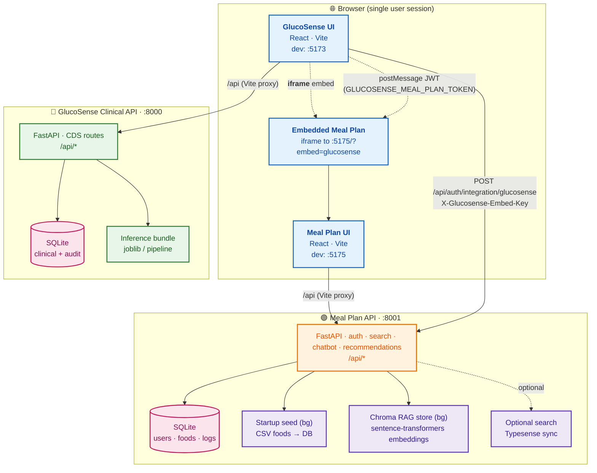
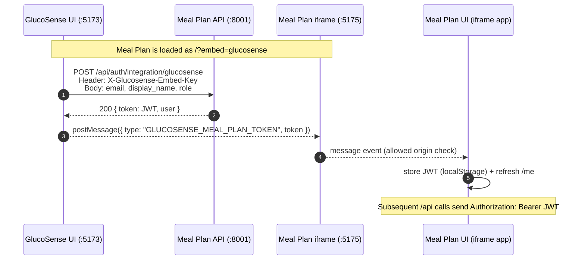
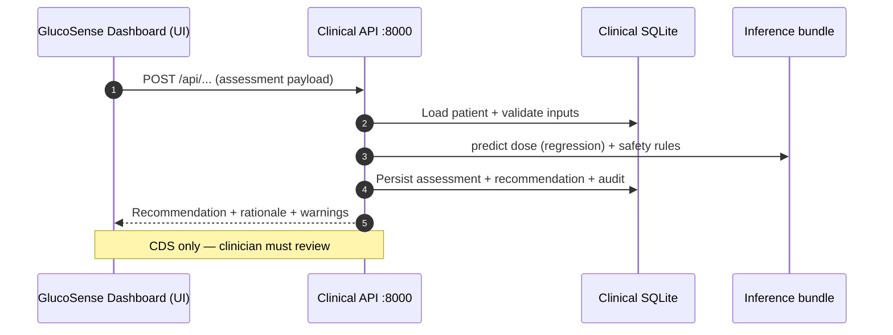
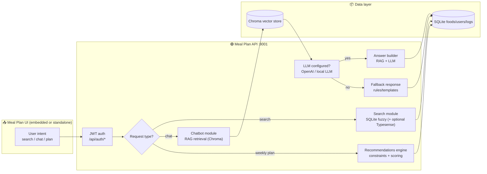
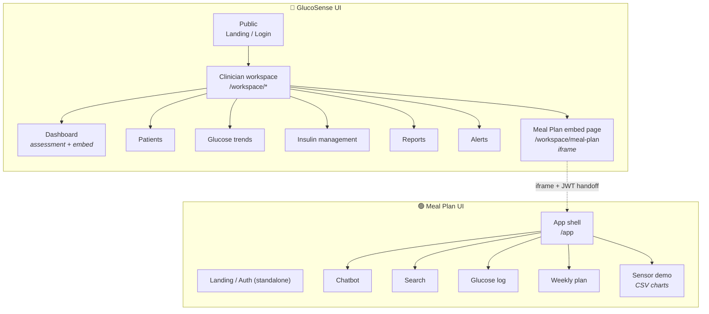
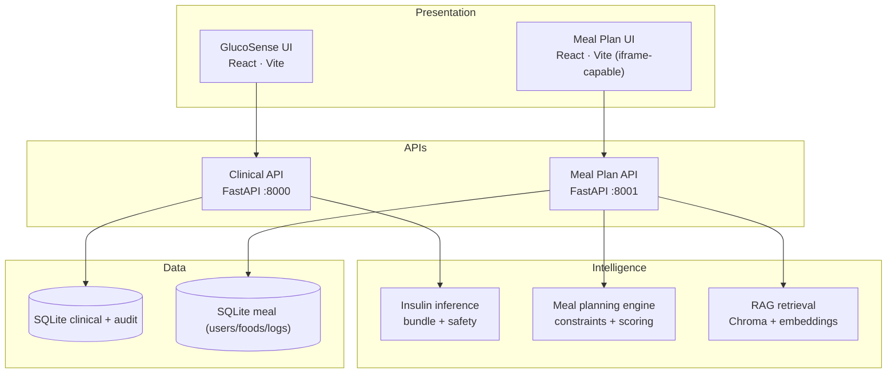

# GlucoSense — UI Architecture Diagrams (Mermaid)

Use these in **Slide 8** (Design) or as appendix figures. Render in [Mermaid Live Editor](https://mermaid.live), VS Code Mermaid preview, or export to PNG/SVG for PowerPoint.

**What these reflect (current system):**
- **GlucoSense (Clinical)**: React (Vite dev typically **:5173**) → FastAPI API **:8000** → SQLite + inference bundle.
- **Meal Plan (Nutrition)**: React (Vite dev **:5175**) → FastAPI API **:8001** → SQLite + background seed + Chroma RAG (+ optional Typesense).
- **Integration**: GlucoSense embeds Meal Plan UI in an **iframe** and performs **SSO via JWT handoff**:
  1) GlucoSense calls Meal API `POST /api/auth/integration/glucosense` with `X-Glucosense-Embed-Key`
  2) Receives a Meal Plan JWT
  3) Sends JWT into the iframe using `window.postMessage({ type: 'GLUCOSENSE_MEAL_PLAN_TOKEN', token })`

**Tip:** If a viewer does not support `classDef` styling, diagrams still render with default colors.

---

## 1. Big picture: integrated runtime topology (dev)

---

## 2. Embed + SSO: GlucoSense → Meal Plan JWT handoff (sequence)

---

## 3. Clinical workflow: assessment → recommendation (sequence)

---

## 4. Meal Plan: request handling (RAG chatbot + engine)

---

## 5. UI route map (GlucoSense clinician vs patient)

---

## 6. Layered stack (single slide summary)

